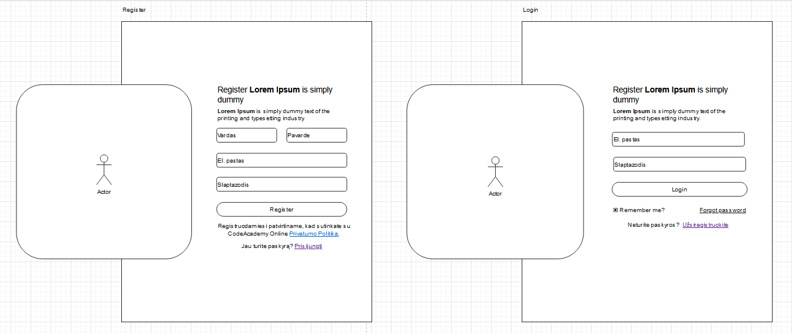
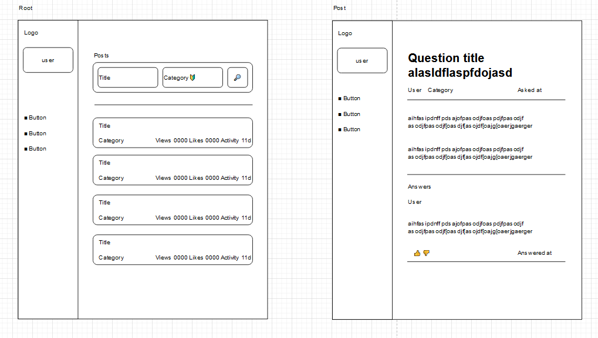
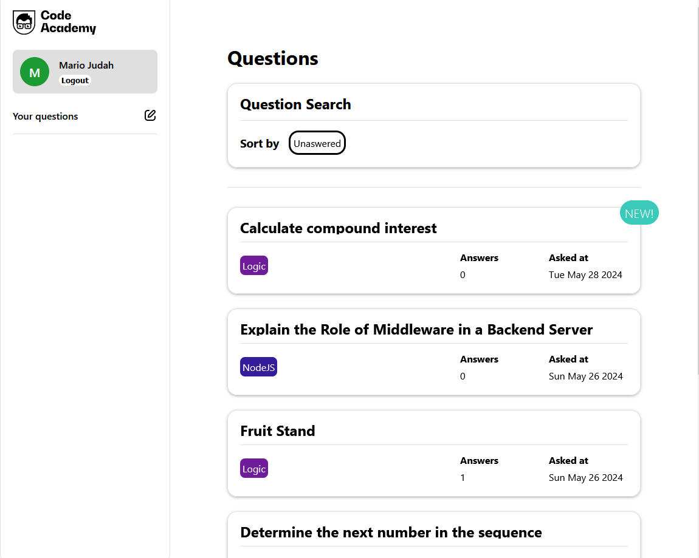
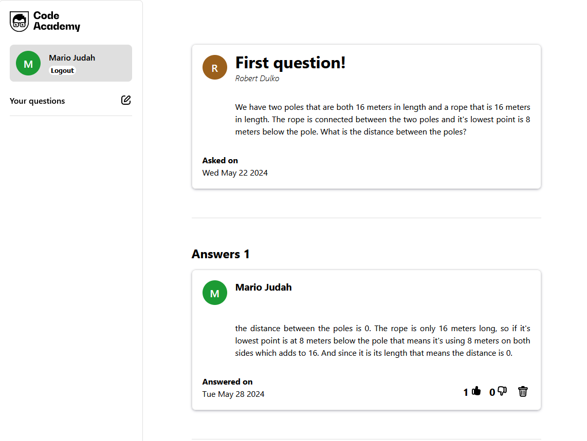
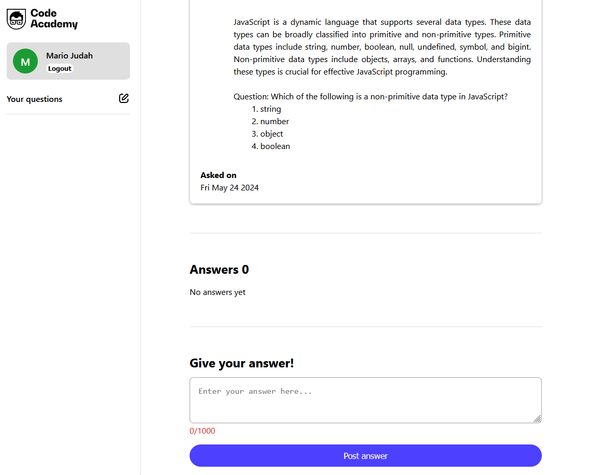
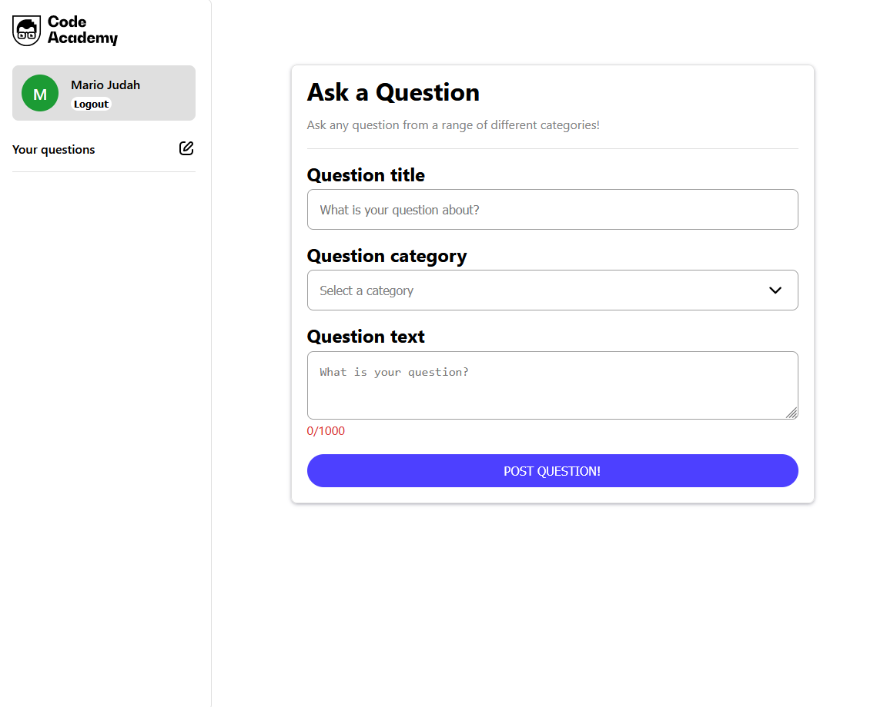
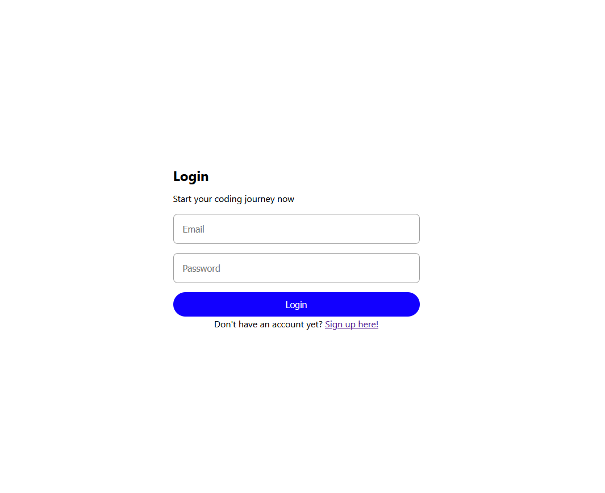
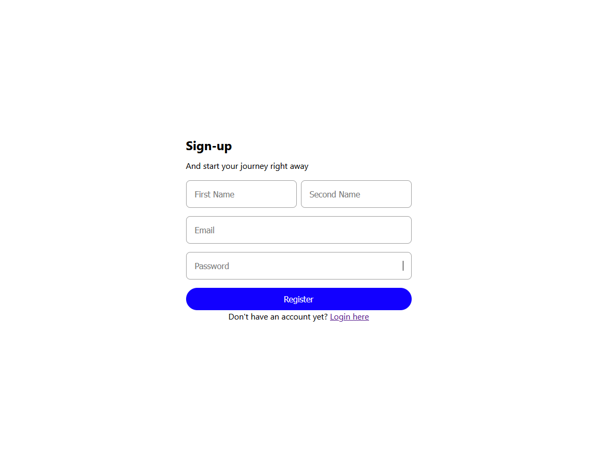

# Final CodeAcademy project

During this project an internet forum was made using React for frontend, NodeJS Express for backend and MongoDB for dababase.

With the application users can post questions. Questions consist of question title, question text. Users can leave answers under posted questions and like or dislike other answers. User would not be able to do all of these actions without being logged in. So user can register/login to get authenticated. Without being authenticated an user can only view questions/answers.

Another challenge was to come up with the design myself. I drew up a wireframe taking inspiration from several different forum pages. The page had to be responsive.

## Frontend Functionality:

### Authentication

- [x] Register
- [x] Login

### Questions

- [x] View question list
- [x] Ask new questions (authenticated)
- [x] Delete questions (authenticated)
- [x] Filter by answered and unanswered questions // EXTRA

### Atsakymai

- [x] View question answers
- [x] Answer under a question (authenticated) // EXTRA
- [x] delete answer (authenticated) // EXTRA
- [x] Like/dislike answers (like/dislike) (authenticated)

## Backend

- [x] POST /register
- [x] POST /login

- [x] GET /questions
- [x] POST /question
- [x] DELETE /question/:id

- [x] GET /question/:id/answers
- [x] POST /question/:id/answers
- [x] DELETE /answer/:id

## Evaluation criteria

- During final showcase and review these criteria for the final mark where considered:

* Code quality;
* Best coding practices;
* Functional requirement completeness;
* General design;
* Answers to teacher's questions;

## Backend

[Link to backend](https://github.com/OverlyDevoted/code-academy-forum-back)

## Wireframes

## Final project images

### Main page

### Question page

### Question page answering portion

### Ask page

### Login page

### Register page

## Extra tasks/improvements

- [x] Header offset
- [x] Header responsiveness
- [x] Clear fields on question asked
- [x] Redirect button on question asked
- [ ] Data removal dialogs
- [ ] view your questions on sidebar
- [ ] Make logout button prettier
- [ ] Optimisitc UI update (when liking)
- [ ] Userbadge loading state
- [ ] finish register/login styling
- [ ] prettier dialogs
- [ ] make UI more alike to cao.lt
- [ ] button UI shift when loading
- [ ] Improved search. Filter by date, answers, category, name
- [ ] skeleton loading for items
- [ ] infinite scroll questions/asnwers
- [ ] markdown
- [ ] profanity checks
- [ ] microsoft login (for codeacademy emails)
